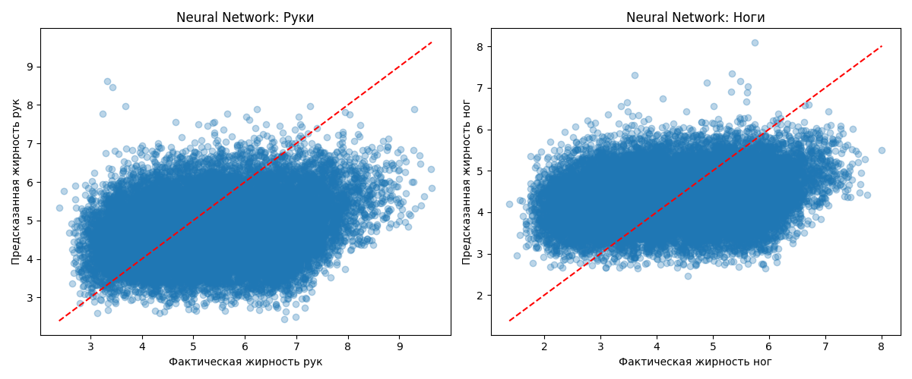
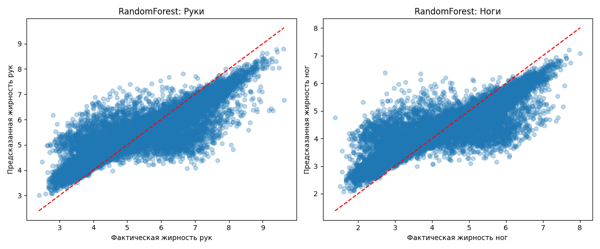

# 🧬 Fat Prediction AI


🚀 **Fat Prediction AI** — это интерактивное приложение для прогнозирования распределения жира в руках и ногах пациента на основе медицинских данных и принимаемых препаратов.

> ✅ Поддержка двух моделей: RandomForest и Neural Network (TensorFlow)  
> ✅ Удобный ввод данных пациента  
> ✅ Наглядные визуализации предсказаний  
> ✅ Встроенная аналитика исходных данных

## 📸 Скриншоты

### Random Forest Prediction


### Neural Network Prediction


## 🚀 Как запустить

1. Клонируйте репозиторий:
```bash
git clone https://github.com/ваш-профиль/fat_prediction.git
cd fat_prediction
```

2. Установите зависимости:
```bash
pip install -r requirements.txt
```

3. Запустите приложение:
```bash
streamlit run app.py
```

4. Перейдите по адресу:
```
http://localhost:8501
```

## 🧩 Используемые технологии

- Python 3.10
- Streamlit
- TensorFlow
- scikit-learn
- pandas, numpy
- Plotly для визуализаций

## 📂 Структура проекта

```
fat_prediction/
│
├── fat_model.pkl                # RandomForest модель
├── fat_model_tf/                # TensorFlow SavedModel
├── synthetic_medical_dataset.csv # Синтетические данные
├── app.py                       # Streamlit приложение
├── requirements.txt             # Зависимости
├── neural_network_prediction.png
├── randomforest_prediction.png
└── README.md
```

## 📊 Демо визуализации

- Корреляционная матрица признаков
- Распределение жирности рук и ног
- Визуализация предсказания (Bar Chart и Pie Chart)

## 💡 Примечания

> Для корректной работы рекомендуется использовать Python 3.10 и TensorFlow 2.15+.

## 📄 Лицензия

MIT License. Свободно для личного и коммерческого использования.

---

© 2025 Fat Prediction AI — Ваша система прогноза распределения жира 🧬
